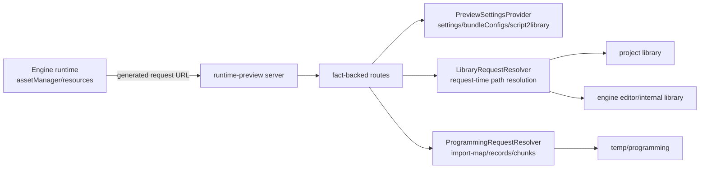

# CLI Runtime Preview 设计

记录时间：2026-06-06

## 目标

在 `cocos-cli` 中实现一个可快速验证 Cocos Creator 3.8.x runtime loading flow 的 preview server。它要复用 CLI 已有 AssetDB、builder、scripting/npm 包能力，读取 project `library`、internal library、`temp/programming` 和 engine source 事实，让 engine runtime 自己产生 URL，server 只把这些已产生的请求映射到真实产物文件。

这个设计的第一优先级是正确性和短链路反馈：Vitest/HTTP contract 能尽早验证 settings、bundle config、script map、`resources.load`、import/native parser 链路；打开浏览器只作为最后集成测试。

## 文档边界

- `runtime-preview-architecture-facts-20260606.md` 只记录源码证据、产物事实、已确认结论和待验证项。
- 本文档记录架构决策、模块边界、route 分类、性能 contract 和测试策略。
- `2026-06-06-runtime-preview-mainbase.md` 记录可执行步骤，不应复制大段事实表；事实变化先改 facts，再同步 design/plan 中的决策或任务。

## 非目标

- 不自创 URL 规则。
- 不在 production startup 递归扫描 `library`、`temp` 或构建几十万文件级别的全量 URL/file index。
- 不默认修改 `D:\workspace\engines\cocos\3.8.6`。
- 不全盘复制旧 editor preview server 或备份分支实现。
- 不把测试样本扫描策略迁移到 production server。

## 事实优先级

| 优先级 | 来源 | 用途 |
| --- | --- | --- |
| P0 | Engine source：`D:\workspace\engines\cocos\3.8.6` | URL 生成、`assetManager`、bundle config、parser/downloader、`editor-path-replace.ts` |
| P0 | CLI AssetDB / builder / scripting source：`E:\own_space\engines\cocos-cli` | `asset.library`、`meta.files`、`getPreviewSettings()`、`script2library`、`compileScripts()` |
| P1 | 冻结 editor `library` / `temp/programming` | editor-generated output compatibility baseline |
| P1 | 旧版 editor preview server source | route 名称、`generate-settings`、scripting facet 行为参考 |
| P2 | 备份分支旧实现 | 业务意图和可迁移片段参考 |

原则：旧实现只能证明“曾经怎么做”和“业务意图是什么”；真正的 URL、settings、library、programming contract 必须由 engine source、CLI source 和产物事实确认。

## 架构

### RuntimePreviewContext

`RuntimePreviewContext` 只保存 roots、providers 和 bounded cache handles：

- `projectRoot`
- `engineRoot`
- `projectLibraryRoot`
- `internalLibraryRoot`
- `projectProgrammingRoot`
- `cliProgrammingRoot`
- `editorLibraryRef`，仅测试使用
- `editorProgrammingRef`，仅测试使用
- `settingsProvider`
- `assetMetadataProvider`
- `programmingProvider`
- `pathResolutionCache`，必须有容量上限和失效策略

它不能在 constructor 或 startup 递归枚举 `projectLibraryRoot`、`projectProgrammingRoot`、`cliProgrammingRoot` 或 reference roots。metadata、records、chunks 必须通过 provider lazy 读取，例如 `AssetMetadataProvider.getByUuid()`、`PreviewSettingsProvider.getBundleConfig()`、`ProgrammingProvider.getImportMap()`。文档中提到的 AssetDB query、metadata、per-uuid files、records、chunks 是 data sources，不是 context startup state。

### PreviewSettingsProvider

优先复用或等价封装 CLI `getPreviewSettings()`：

- 生成 `settings.js` / `settings.json`。
- 缓存 `bundleConfigs`。
- 缓存 `script2library`。
- 输出 `assetBaseConfig`，记录 `assets.server`、`remoteBundles`、`importBase`、`nativeBase` 等 engine 会消费的字段。

如果某个字段不能直接从 CLI API 获得，必须在事实文档中写明 engine/old editor/output 证据，再补 adapter。

性能 contract：

- 允许读取 CLI preview settings 必需 inputs、AssetDB metadata query、script runtime map。
- 禁止触发正常 build output copy、plugin build hooks、全量 asset copy 或完整 build pipeline。
- 可以在 server startup 后后台预热，也可以在第一次 `/settings.js` 前 lazy 生成；无论哪种方式都必须输出耗时日志和超时诊断。
- 测试必须断言 settings generation 没有执行正常 build 输出或全量 copy 行为。

当前实现边界：
- `PreviewSettingsProvider` 默认委托 CLI `getPreviewSettings()`，测试可注入等价 loader。
- 它只负责缓存、timeout/timing diagnostics、`settings.js` 包装、`script2library` 暴露和 `assetBaseConfig` 提取。
- 它不是第二套 settings generator；不能在这里手写 bundle config、asset paths、script map 或复制 build artifacts。

### LibraryRequestResolver

输入是 engine/runtime 已经发出的请求，例如 `/assets/<bundle>/import/...` 或 `/assets/<bundle>/native/...`。resolver 的职责是：

1. 校验和 normalize request tail，拒绝 path traversal。
2. 根据 route category、bundle config、AssetDB/library metadata、internal library 事实选择候选 root。
3. 对候选 path 做直接 `exists` / `stat`。
4. 返回 absolute path 和诊断上下文。

禁止行为：

- 根据 extname 决定 import/native 语义。
- 根据 uuid 目录规则先验拼出所有 URL。
- 启动时扫描全部 files。

### ProgrammingRequestResolver

负责 preview scripting 产物。root 命名必须区分 production output 与 reference output：

- `projectProgrammingRoot`：project 的 `temp/programming`。
- `cliProgrammingRoot`：CLI 可能生成的 `temp/cli/programming` 或等价 output。
- `editorProgrammingRef`：冻结 editor reference，只用于测试对照。

`editorProgrammingRef` 当前指向冻结 `temp` reference 根；测试构造 `RuntimePreviewContext` 时必须传入 `editorProgrammingRef/programming` 作为 `projectProgrammingRoot`，不能让 production resolver 自动补一层 `programming`。

主要文件：

- `projectProgrammingRoot/packer-driver/targets/preview/import-map.json`
- `main-record.json`
- `assembly-record.json`
- `chunks/**`
- `cliProgrammingRoot/preview/systemjs/system.js` 或经 CLI scripting source 确认的等价 SystemJS output
- `custom-macro.js`
- `script2library` 指向的 project script library file

它可以缓存小型 JSON records/import-map，但 chunk 文件仍按请求读取。业务语义优先来自 records/import-map，不能用 regex 解析 chunk 推导模块关系；regex 只能用于测试中确认 `System.register` 存在。

当前已验证的最小脚本链路：
- `/scripting/x/packer-driver/targets/preview/import-map.json`、`main-record.json`、`assembly-record.json` 通过 request-time resolver 按需读取。
- import-map 中 `./chunks/**.js` 转成 `/scripting/x/packer-driver/targets/preview/chunks/**.js` 后必须能解析到真实 chunk 文件。
- `dependScripts` 不直接指向 chunk；它先指向 project script asset uuid，再由 script asset 的 `db://assets/**/*.ts` 转为 project source `file:///.../assets/**/*.ts` module URL。当前验证范围仅覆盖 frozen project asset scripts，不覆盖 internal、extension mount、plugin/global scripts 或 `script2library`。
- 该 module URL 必须同时被 `import-map.json#imports`、`main-record.json#modules` 和 `assembly-record.json#entries` 记录，`main-record.modules[moduleUrl].mTimestamp.uuid` 必须等于 script uuid，`main-record.chunkId` 必须存在于 `assembly-record.chunks`，且 import-map chunk 文件名必须匹配该 `chunkId`。
- production 启动不得为了建立这条链扫描 `chunks/**`；允许 lazy 读取小型 records/import-map，chunk 只在实际请求时读取。

## Route 设计

每个 route 都必须能指向事实来源，并按默认实现级别分类。只有 `Engine-required` 进入 production 默认 route set；`Observed/conditional` 必须由 captured request 或明确 CLI/browser 需求触发；`Diagnostic/reference-only` 不参与正常加载路径。

### Engine-required routes

| Route | 主事实来源 | 次级参考 | 实现策略 |
| --- | --- | --- | --- |
| `/settings.js` | CLI `getPreviewSettings()`、engine settings consumption | old editor `generate-settings` | 返回 `window._CCSettings = ...` |
| `/assets/:bundle/config.json` | `bundleConfigs`、engine `downloadBundle()` | old editor route | 按 bundle name 返回 config |
| `/assets/:bundle/index.js` | engine `downloadBundle()` 请求 index | old editor dummy bundle script | 只实现 engine 需要的 dummy entry |
| `/remote/:bundle/config.json` | `assets.server`、`remoteBundles`、bundle config | old editor route | remote bundle 同源事实驱动 |
| `/remote/:bundle/index.js` | engine `downloadBundle()` | old editor route | 同 `/assets/:bundle/index.js` |
| `/assets/:bundle/import/*` | engine request path、bundle config、AssetDB/library metadata | old editor route | request-time resolve 到 project/internal library |
| `/assets/:bundle/native/*` | engine request path、nativeDep、bundle config、AssetDB/library metadata | old editor route | request-time resolve 到 project/internal library |
| `/remote/:bundle/import/*` | engine request path、remote bundle config | old editor route | remote 语义下 request-time resolve |
| `/remote/:bundle/native/*` | engine request path、remote bundle config | old editor route | remote 语义下 request-time resolve |
| `/scripting/x/*` | `temp/programming` preview records/chunks | old editor `Facet.loadPackResource()` | request-time serve preview target |
| `/scripting/systemjs/*` | CLI scripting SystemJS output | old editor route | serve `system.js` |
| `/scripting/userland/macro` | `custom-macro.js` / `cc/userland/macro` mapping | old editor route | serve macro or clear diagnostic |
| `/query-extname/:uuid` | engine `editor-path-replace.ts`、AssetDB/library metadata | old editor route | 只返回 import payload extension，例如 `.cconb` |

### Observed/conditional routes

| Route | 主事实来源 | 次级参考 | 启用条件 |
| --- | --- | --- | --- |
| `/settings.json` | CLI `getPreviewSettings()` | old editor game-view settings | captured request 或明确 CLI/browser 需要 JSON settings |
| `/plugins/*` | CLI `script2library` | old editor `script2library` | captured script request 或 project script runtime 明确需要 |
| `/scripting/import-map-global` | CLI/engine scripting import map facts | old editor `Facet.getGlobalImportMap()` | captured scripting bootstrap request |
| `/scripting/engine/*` | engine source/build/cache fact | old editor route | captured request 且路径由 engine source/build fact 确认 |
| `/scene/*.json` | AssetDB scene info / library serialized JSON | old editor scene route | serve real scene JSON |

### Diagnostic/reference-only routes

| Route | 主事实来源 | 次级参考 | 处理 |
| --- | --- | --- | --- |
| `/missing-asset/*` | AssetDB missing asset query | old editor route | diagnostic route only |

`/query-extname/:uuid` 不是 import/native mapping 规则。它只服务 current engine preview branch 中 `editor-path-replace.ts` 的扩展名替换需求。

Asset import/native route shape 是 engine-required，但具体 request path 仍必须来自 captured/runtime fact、bundle config 或后续 AssetDB/library metadata fact。当前 Task 12 只允许 HTTP-base captured URL 集合中的 import request；未捕获的 native、remote、pack、redirect 形态必须返回 404，不能因为 tail 碰巧命中文件就服务。

## 性能设计

启动路径应保持 O(1) 或接近 O(1)：

- 解析 root paths。
- 初始化 server。
- 初始化 `RuntimePreviewContext`。
- 不递归扫描 `library`。
- 不递归扫描 `temp/programming`。
- 不构建全量 URL/file index。

请求路径：

- `/settings.js` 或需要 bundle config 的请求可调用/刷新 `PreviewSettingsProvider`；允许 server startup 后后台预热，但不得触发正常 build/full copy。
- asset import/native 请求只 normalize 当前 request tail，并检查有限候选 path。
- programming 请求只读取当前请求所需 JSON/chunk；小型 records/import-map 可以缓存。
- 可以增加小型 LRU 缓存 positive/negative path resolution，但必须有失效策略，不能变成 startup index。

测试代码可以扫描冻结样本来自动选择 representative assets；production code 不能复用这种扫描作为启动行为。

## Editor output 与 CLI output 对齐

冻结 editor `library` 和 `temp/programming` 是兼容性参考产物。CLI AssetDB 生成的产物如果与 editor output 不一致，需要按以下顺序处理：

1. 判断差异属于生成目录、metadata shape、`asset.library`、`meta.files`、`script2library`、`dependScripts`、programming records，还是测试 fixture。
2. 查 CLI AssetDB/builder/scripting source，确认当前 CLI 行为是否有事实支撑。
3. 查 engine source，确认 runtime preview 实际消费哪种 shape。
4. 如果 engine preview 期望 editor-generated shape，而 CLI output 不一致，优先让 CLI output 或 adapter 靠近 editor semantics。
5. 禁止把冻结 editor 文件复制进 production 作为绕过。

需要覆盖的对齐点：

- `library` root/layout。
- `.assets-data.json`、`.assets-info1.0.0.json`、`.assets-dependency.json`。
- `.internal-data.json`、`.internal-info1.0.0.json`、`.internal-dependency.json`。
- `asset.library` 和 `meta.files`。
- serialized JSON/native-like files。
- `script2library`。
- `dependScripts`。
- `temp/programming/packer-driver/targets/preview` records/chunks。
- SystemJS 和 `custom-macro.js`。

## 旧实现使用方式

旧 editor preview server：

- 可参考 route names、settings/script cache、scripting facet、`query-extname` 行为。
- 不可直接作为 URL mapping 权威。
- 不可直接复制 Editor.Message / Editor.Project 依赖。

备份分支旧实现：

- 可参考 CLI command/server lifecycle、部分诊断和业务意图。
- resolver-first 或 extname-guessing 方案必须重新审查；若无 engine/CLI/output 事实支撑，归类为废弃实现方式。

## 测试策略

测试目标是尽早真实验证加载链路：

1. `on-demand-resolver.test.ts`：验证 startup 不扫描、path traversal 被拒绝、无 captured fact 的 asset URL 不解析、programming 已知文件可按请求读取。
2. `engine-source-runtime.probe.test.ts`：Vitest 引入真实 engine source，只 mock host boundary。
3. `editor-cli-output-consistency.test.ts`：冻结 editor output 与 CLI AssetDB output representative sample 对齐。
4. `editor-library-resources-load.probe.test.ts`：filesystem-base probe，真实 `resources.load` 进入 engine downloader/parser，但不输出 HTTP route contract。
5. `http-url-capture.probe.test.ts`：HTTP-base probe，用 serverURL/settings/bundle config 捕获真实 runtime URLs。
6. `script-runtime-map.test.ts`：验证 `dependScripts` 到 preview import-map、main-record、assembly-record、chunks 的连接；`script2library` 由 `settings-generation.test.ts` / HTTP contract 继续验证。
7. `settings-generation.test.ts`：验证 `getPreviewSettings()` / equivalent output。
8. `http-contract.test.ts`：验证 routes 来自事实，request-time resolver 服务文件；asset import/native/pack/redirect requests 优先来自 HTTP-base probe 捕获的 runtime URLs，不能手写近似 URL。
9. browser smoke：仅在短链路测试通过后打开浏览器。

Vitest harness 可以参考 `F:\ps_copy\p6\trunk\Project\GameClient\Client-ai_master\tests` 的真实 engine source 引入方案；该路径是本机 optional reference，缺失时以 current engine source 和本项目 harness 为准。runtime preview 常量语义必须是 `PREVIEW=true`、`TEST=false`，不能照搬 P6 business test 的 `TEST=true`、`PREVIEW=false`。

2026-06-07 当前验证状态：

- `vitests` 全量通过只能说明现有测试可执行，不等于上述测试策略已闭环。
- 已确认有效：engine-source harness 使用 runtime preview 语义，`PREVIEW=true`、`TEST=false`；script/import-map/dependScripts 测试已连接到 `.assets-data.json` 和 programming 产物。
- 尚未达标：真实 CLI AssetDB output consistency、完整 `resources.load` parser coverage、native/pack/redirect HTTP-base URL capture、真实 `getPreviewSettings()` E2E、真实 CLI/Launcher startup asset HTTP smoke。
- 在这些 gap 补齐前，不能声明 HTTP contract 代表 production `preview --runtime` 行为，也不能进入 browser integration。

## Engine 修改门槛

默认不修改 engine source。只有同时满足以下条件才提出 engine patch：

- current engine source 证明 runtime preview 必需能力缺失或行为错误。
- 有稳定失败复现。
- 已排除 CLI/server/runtime context/test host boundary 问题。
- 写出 engine patch 影响范围和替代方案。
- 用户确认后再执行。
