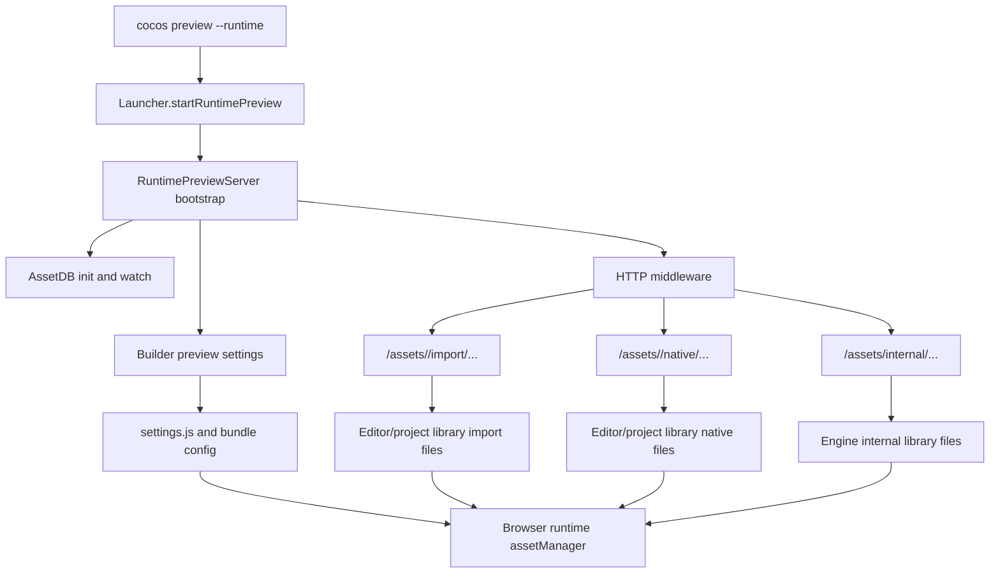

# Runtime Preview Mainbase Handoff

记录时间：2026-06-06

## 目标

把 `runtime-preview` 重新建立在最新 `cocos-cli` 主线基线上，但不直接在 `main` 上开发。工作分支仍然是 `adapter-to-386`，它需要切到最新 `origin/main` 提交后再迁移实现意图。

最终目标不是修单个 404 或单个 `settings.js` 报错，而是让 `asset-db` 生成的 `library` 产物与 Creator 编辑器生成的 `library` 结构基本一致，并让 `runtime-preview` 保持正常运行时加载语义。`preview-server` 只负责把运行时 URL 映射到正确的 `library` 文件，不能改变 import/native/internal 的引擎解析语义。

## 关键边界

- 不在 `main` 分支直接修改；`adapter-to-386` 才是后续迁移分支。
- `D:\workspace\engines\cocos\3.8.6` 的引擎适配分支也必须回到未因 `runtime-preview` / `cocos-cli` 适配而修改的状态，再从干净分支重新引入必要改动。
- 之前的错误方向实现、需求意图、临时文档、引擎 `NODEJS` adapter 修改都保留在备份分支，只作为事实和意图参考。
- 当前会话不继续做实现修复；先把环境、参考样本、索引、测试设计、事实文档的顺序定清楚，等确认后进入新会话执行。

## 已有备份

### cocos-cli

- `codex/backup-runtime-preview-bad-20260606`
- 作用：保留已知错误方向的 `runtime-preview` 修复尝试、业务意图、局部文档和调试痕迹。

### 3.8.6 引擎

- 仓库：`D:\workspace\engines\cocos\3.8.6`
- 备份分支：`codex/backup-engine-current-20260606`
- 备份提交：`fa6ff2c406 backup(engine): capture current nodejs adapter state`
- 注意：普通 git 提交没有包含 ignored 的 `bin/.cache/dev-cli/**`。这类 cache 只能作为运行现场参考，不能当作可复现源码状态。

## 当前事实

### cocos-cli 分支事实

2026-06-06 已执行基线切换：

- 当前分支：`adapter-to-386`
- 当前 HEAD：`71b2ad89883e2fb73383f599a1a80c17400328c6`
- 当前 HEAD 说明：`[break] Expose internal node asset query APIs (#617)`
- 当前关系：`adapter-to-386...origin/main`，本地分支与 `origin/main` 对齐。
- 当前普通工作区：只有本 handoff 文档为未跟踪文件；除此之外没有源码改动。

已保存的 cocos-cli 现场：

- 原 `adapter-to-386=957f835` 指针保留为 `codex/backup-adapter-to-386-957f835`。
- 错误方向实现快照保留为 `codex/backup-runtime-preview-bad-20260606`。
- `stash@{2026-06-06 14:37:31}`：`codex-save-handoff-before-clean-baseline-20260606`，保存过本 handoff 文档。
- `stash@{2026-06-06 14:38:08}`：`codex-save-untracked-runtime-preview-before-clean-baseline-20260606`，保存旧 `src/runtime-preview/` 和 `temp/` 残留。

注意：当前文档是从 stash 单独恢复出来用于记录事实，不代表旧 runtime-preview 实现已恢复。

### 引擎分支事实

2026-06-06 已执行基线切换：

- 仓库：`D:\workspace\engines\cocos\3.8.6`
- 当前分支：`codex/nodejs-adapter-3.8.6`
- 当前 HEAD：`a3bd63713556438cad25651b6079f89d837c1166`
- 当前 HEAD 说明：`spine编译提交`
- 当前源码基线：已切到预期提交。
- 当前普通工作区注意事项：如果 Creator 3.8.6 正在运行，工作区可能会反复出现 `editor/assets/**/*.meta` 字段顺序变化；这不是 runtime-preview 适配源码，不能提交为本任务改动。2026-06-06 14:50 已观察到 33 个 built-in asset `.meta` 被运行中的 `CocosCreator.exe` 重写。

已保存的 engine 现场：

- 备份分支：`codex/backup-engine-current-20260606`
- 备份提交：`fa6ff2c406 backup(engine): capture current nodejs adapter state`
- `stash@{2026-06-06 14:37:31}`：`codex-save-engine-meta-before-clean-baseline-20260606`，保存切换前 `editor/assets/primitives.fbx.meta` 的临时改动。
- `stash@{2026-06-06 14:49:58}`：`codex-save-engine-meta-order-before-clean-baseline-20260606`，保存切换后出现的 33 个 `editor/assets/**/*.meta` 字段顺序变化。

引擎当前备份分支已经保留了 `NODEJS` adapter、`cc.config.json`、`ccon.ts` 暴露、PAL nodejs 实现、`scripts/build-adapter.js` 等改动。后续适配分支应保持当前干净基线，再根据事实链逐项引入。

需要区分：

- 引擎源码提交：可复现、可 review、可关联 `cocos-cli` 需求。
- 引擎 cache：`bin/.cache/dev-cli/**`，运行产物，不应作为设计依据或提交依据。
- 编辑器生成的 `editor/library`：可作为参考样本，但不能直接混入引擎源码提交。

## 推荐优先级

### P0：固定干净基线

目标：消除当前不可信的运行环境变量。

状态：已完成分支基线切换；仍需在 Creator/preview 进程停止后重新确认工作区、package/cache 状态。

1. `cocos-cli` 工作分支 `adapter-to-386` 已切到最新 `origin/main`。
2. 3.8.6 引擎适配分支已切回 `codex/nodejs-adapter-3.8.6` 的干净源码状态。
3. 已保存旧实现、临时文档、`temp/`、引擎 `.meta` 工作区刷新改动。
4. 尚未在新基线上运行 `npm ci`、重编译 engine cache 或启动 preview。
5. 当前检测到 Creator 3.8.6 进程可能会重写 `D:\workspace\engines\cocos\3.8.6\editor\assets/**/*.meta`；在记录最终 clean 状态前需要关闭 Creator 或确认不再写入。
6. 下一步在 P1 前应停止所有旧 preview 进程，确认 `19530` 无监听，并记录关键 package 版本。

通过标准：

- `cocos-cli` 在 `adapter-to-386@71b2ad8`，除本 handoff 文档外无源码改动。
- engine 在 `codex/nodejs-adapter-3.8.6@a3bd637135`。
- 关闭 Creator/preview 后，engine 普通工作区应恢复或处理到干净；若仍有 `editor/assets/**/*.meta` 字段顺序变化，只能作为运行现场噪声保存或舍弃，不能纳入 runtime-preview 适配提交。
- 没有旧 preview 进程。
- 没有把 cache 状态误认为源码状态。

### P1：生成并冻结编辑器 library 参考样本

目标：拿到 Creator 编辑器生成的正确 `library`，作为后续对照，不再凭报错猜产物结构。

用户操作：

1. 清理小项目 `E:\own_space\cocos_work_lab_38x\library`。
2. 用 Creator 编辑器打开小项目。
3. 等编辑器导入完成，确认 `library` 可用。
4. 通知 Codex。

Codex 后续动作：

1. 复制一份 editor-generated `library` 到 `cocos-cli` 工作区外或 ignored 目录，例如：

```text
E:\own_space\engines\cocos-cli\.codex-tmp\reference-library\cocos_work_lab_38x-editor-library-20260606\
```

2. 同时保存最小索引信息：

```text
library/.assets-data.json
library/.internal-info.json
library/.internal-data.json
library/.internal-dependency.json
关键 import/native/internal 文件清单
```

3. 不把完整 `library` 提交到 git。

通过标准：

- 有一份只读参考 `library` 副本。
- 能按 uuid 找到 import/native/internal 文件。
- 能列出至少以下资源类型的编辑器产物路径：scene、prefab、Texture2D、SpriteFrame、TTF font、BitmapFont/atlas、AnimationClip、Material、Effect、JsonAsset、Spine、Plist/AutoAtlas。

### P2：建立索引和源码事实认知

目标：先理解事实流程，再迁移实现意图。

需要索引的源码范围：

- `E:\own_space\engines\cocos-cli`
- `D:\workspace\engines\cocos\3.8.6`
- `E:\own_space\engines\cocos-cli\node_modules\@cocos\asset-db`
- `E:\own_space\engines\cocos-cli\node_modules\@cocos\ccbuild`
- `E:\own_space\engines\cocos-cli\node_modules\@cocos\lib-programming`
- 必要时补充 `@cocos/quick-compiler`

工具分工：

- `codegraph`：用于结构化入口、调用方、被调用方、trace、impact。
- `Semble`：当前会话未挂载 MCP tool，先用 CLI 方式执行；用于 chunk-level retrieval，适合找入口、文档、配置、相似实现；不能当作调用链证明。
- `rg`：用于精确文本定位和核对产物路径。

Semble 注意事项来自 `E:\own_space\ai-workflow-lab` 既有 PoC：

- 设置 `PYTHONUTF8=1`，避免 Windows GBK 读取 `chunks.json` 失败。
- 优先用 `uv run --python 3.12 semble ...`。
- CLI 持久化 index 变更后需要重新 `semble index`。
- Semble 的结果是候选上下文，不是确定性 call graph。
- 对 docs/config/test 混合查询应使用 `--content all` 或单独建混合索引。
- 2026-06-06 验证：`codegraph` 对 `E:\own_space\engines\cocos-cli` 可用；`D:\workspace\engines\cocos\3.8.6` 尚未初始化，需要在清理引擎分支后执行 `codegraph init`。
- 2026-06-06 验证：`Semble MCP` 当前未出现在 Codex 可调用工具中；`Semble CLI` 可用。
- 2026-06-06 验证：对整个 `cocos-cli` 执行 `semble index` 超过 3 分钟未完成，不作为当前主流程；对 `src` 执行 `semble search ... --content code` 可用但耗时约 71 秒；`semble find-related` 对具体文件行可用，耗时约 9 秒。
- 当前执行策略：以 `codegraph` 为主索引；Semble CLI 只做局部 `search` / `find-related` 辅助检索，必要时再针对小范围目录生成 index。

通过标准：

- 能用 `codegraph` 回答 runtime-preview server 到 builder/settings 的入口链。
- 能用 `codegraph` 或源码阅读确认引擎 runtime 加载 import/native 的决策点。
- 能用 Semble 找到相关文档、配置、node_modules importer 入口。
- 事实文档中的每个关键结论都有源码路径、函数名或产物路径支撑。

### P3：编写事实文档和流程图

目标：先产出事实文档，等用户确认后再进入迁移实现。

文档建议路径：

```text
E:\own_space\engines\cocos-cli\docs\dev\runtime-preview-architecture-facts-20260606.md
```

必须覆盖：

1. preview 启动流程
2. `asset-db` 启动、扫描、导入、增量监听流程
3. 编辑器 `library` 产物结构
4. `settings.js` 和 bundle config 生成流程
5. 引擎 runtime 的 `assetManager`、`Bundle`、`downloader`、`parser`、`deserialize` 加载链路
6. `editor-path-replace`、`url-transformer`、import/native URL 决策点
7. `preview-server` URL 映射规则
8. internal 资源与 project 资源差异
9. 各资源类型加载矩阵
10. 哪些接口只能查询 metadata，哪些接口会触发数据字段读取，哪些接口不应被 server 滥用

建议流程图：



通过标准：

- 文档能解释为什么不能把 native 二进制返回给 import parser。
- 文档能解释 `settings.js 500` 会如何导致前端 `launch` undefined 这类次生报错。
- 文档能解释一个资源出错时应如何隔离，不应污染其他资源或生成空 import map。
- 文档明确哪些旧备份分支改动是“意图”，哪些是“错误实现”。

### P4：设计独立 Vitest 测试环境

目标：建立不依赖浏览器的、相对真实的资源加载和 URL 映射测试。

参考 `F:\ps_copy\p6\trunk\Project\GameClient\Client-ai_master` 的测试规范：

- 测试放在根级 `tests/`，不要和源码并列。
- 默认使用真实 engine-source runtime，禁止手写 Cocos public API mock。
- 只 mock 不可控边界，例如 IO、网络、全局服务、时间。
- 资源、prefab、bundle、Spine 相关测试必须落在真实项目资源链路上；headless 做不到的部分要登记边界。
- 测试源代码不能写入本机绝对路径，路径通过环境变量提供。

建议在 `cocos-cli` 中新增：

```text
tests/
  package.json
  vitest.config.ts
  shared/
    fixture-paths.ts
    library-snapshot.ts
    http-response-helpers.ts
    runtime-url-fixtures.ts
  suites/
    runtime-preview/
      library-structure-matrix.test.ts
      runtime-url-mapping.test.ts
      settings-generation.test.ts
      import-native-boundary.test.ts
      assetdb-incremental-watch.test.ts
```

环境变量建议：

```text
COCOS_CLI_TEST_PROJECT_ROOT=E:\own_space\cocos_work_lab_38x
COCOS_CLI_TEST_ENGINE_ROOT=D:\workspace\engines\cocos\3.8.6
COCOS_CLI_TEST_EDITOR_LIBRARY_REF=E:\own_space\engines\cocos-cli\.codex-tmp\reference-library\cocos_work_lab_38x-editor-library-20260606
```

测试分层：

1. `library-structure-matrix.test.ts`
   - 对照 editor library，验证每类资源的 import/native/internal 文件结构。
   - 不启动 server。

2. `runtime-url-mapping.test.ts`
   - 输入运行时 URL，例如 `/assets/resources/import/...`、`/assets/resources/native/...`、`/assets/internal/import/...`。
   - 断言 server resolver 映射到正确文件。
   - 不解析资源内容。

3. `import-native-boundary.test.ts`
   - 明确 import URL 只能返回 import 可解析文件。
   - native URL 只能返回 native 文件。
   - 字体、图片、Spine、plist、cconb/bin 都要覆盖。

4. `settings-generation.test.ts`
   - 使用真实或最小化 AssetDB/library fixture 生成 `settings.js` 依赖数据。
   - 断言失败资源不会导致全量 settings 变空或 500。

5. `assetdb-incremental-watch.test.ts`
   - 后续阶段再做。
   - 覆盖新增资源、修改资源、删除资源时 `library` 和 server cache 的失效语义。

第一阶段不建议直接测试浏览器 `assetManager.load`，因为那会把引擎 WebGL、DOM、SystemJS、network 等变量混进来。先测 URL 到文件、settings/bundle config、library 结构。等这三层稳定后，再补 headless 或浏览器 smoke test。

通过标准：

- 不依赖当前机器固定路径；路径全部走环境变量。
- 没有手写 Cocos public API mock。
- 能用同一套 fixture 对照 editor library 与 CLI asset-db 产物。
- 每个测试失败能指向具体层：asset-db 产物、settings 生成、URL 映射、runtime 解析边界。

### P5：迁移备份分支中的实现意图

目标：在最新 `origin/main` 基线和已确认事实文档基础上，重新实现 runtime-preview。

迁移原则：

- 先迁移意图，不迁移错误实现。
- 每个 `cocos-cli` 改动必须能对应事实文档中的流程点和测试。
- 每个引擎源码改动必须说明为什么不能只在 `cocos-cli` 侧处理。
- 引擎提交和 `cocos-cli` 提交分开，不把两边改动混成一个不可 review 状态。

优先迁移的意图：

1. CLI 参数：`preview --runtime --host --port --scene`
2. 使用项目 `package.json["cocos-cli"].enginePath`
3. runtime-preview 独立 server/middleware
4. 复用编辑器 `library` 结构和路径语义
5. 资源导入失败隔离和进度反馈
6. 可选强制重编译参数
7. preview 启动时资源监听与增量导入

暂缓迁移：

- 针对某个 404 的临时 extname 猜测。
- 把 native 文件返回给 import 请求的补洞。
- 未经事实验证的 `query-extname` 泛化逻辑。
- 会改变引擎 runtime 语义的 server 端特殊处理。

## 资源类型矩阵草案

后续事实文档和测试至少覆盖：

| 资源类型 | 关注点 |
| --- | --- |
| Scene | settings scene list、bundle config、import 文件 |
| Prefab | import JSON/cconb、依赖 UUID |
| Texture2D/ImageAsset | import metadata 与 native image 文件 |
| SpriteFrame | Texture2D 依赖、atlas/plist 子资源 |
| TTF Font | import json 与 native `.ttf` 文件边界 |
| BitmapFont | `.fnt/.png` 或 plist/atlas 关系 |
| AnimationClip | `.cconb` / `.bin` / `.json` 真实产物差异 |
| Material | effect/texture 依赖 |
| Effect | shader/effect import 结构 |
| JsonAsset | import 文件与原始 json native 边界 |
| Spine | `.json/.skel/.atlas/.png` 组合关系 |
| Plist/AutoAtlas | plist import、子 SpriteFrame、native texture |
| Internal assets | engine `editor/assets` 产物与 project assets 差异 |

## 新会话启动检查清单

1. 确认 `cocos-cli`：

```powershell
rtk powershell -NoProfile -Command "git -C 'E:\own_space\engines\cocos-cli' branch --show-current; git -C 'E:\own_space\engines\cocos-cli' log --oneline -5; git -C 'E:\own_space\engines\cocos-cli' status --short"
```

2. 确认引擎：

```powershell
rtk powershell -NoProfile -Command "git -C 'D:\workspace\engines\cocos\3.8.6' branch --show-current; git -C 'D:\workspace\engines\cocos\3.8.6' log --oneline -5; git -C 'D:\workspace\engines\cocos\3.8.6' status --short"
```

3. 确认 preview 进程：

```powershell
rtk powershell -NoProfile -Command "Get-NetTCPConnection -LocalPort 19530 -ErrorAction SilentlyContinue | Select-Object LocalAddress,LocalPort,State,OwningProcess"
```

4. 等用户确认 editor library 已生成后复制参考样本。

5. 建索引前先写 `.sembleignore` / CodeGraph 边界策略，避免把大型 cache、library、temp、node_modules 噪声误纳入主索引；但 `node_modules/@cocos/**` 要单独建受控索引。

## 待用户确认

- P0 分支基线已切换；是否关闭 Creator/preview 后再由 Codex 处理 engine `editor/assets/**/*.meta` 工作区噪声。
- editor library 生成后参考副本放在 `.codex-tmp/reference-library/**` 是否合适。
- `cocos-cli` 的 Vitest 测试入口是否采用 `tests/` 独立 package 方案。
- `node_modules/@cocos/**` 是纳入主索引，还是单独建 `cocos-cli-node-modules-cocos` 索引。
